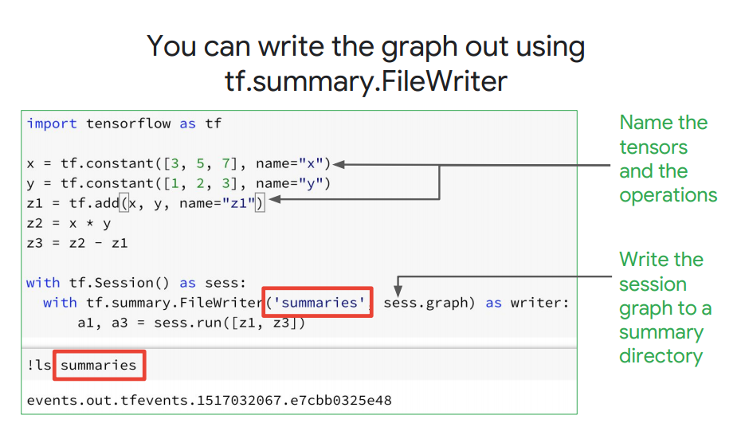
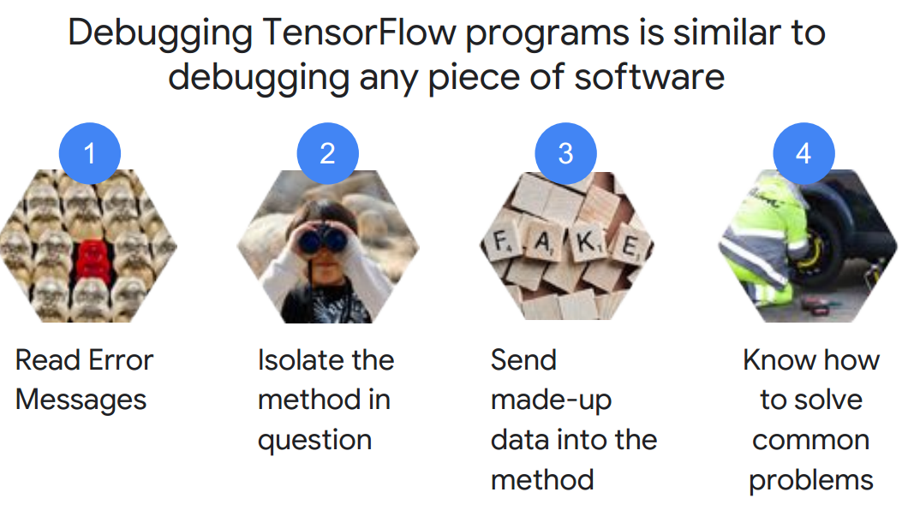
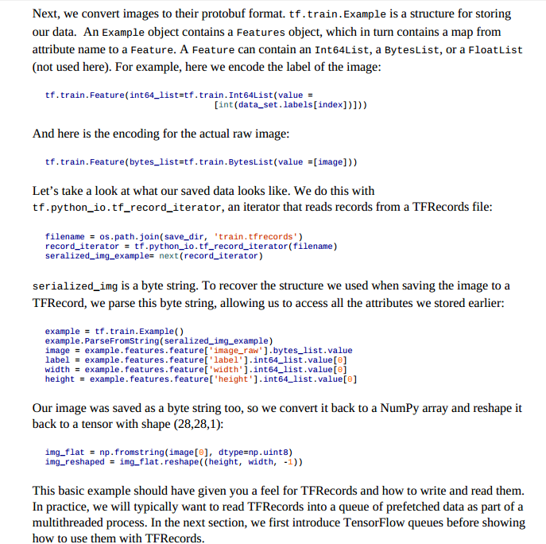

## session

* A Session object is the part of the TensorFlow API that communicates between Python objects and data on our end, 
and the actual computational system where memory is allocated for the objects we define, intermediate variables are stored,
and finally results are fetched for us.

* TensorFlow： 基于数据流图的数值计算的框架


* tensorflow 做lazy evaluation
    * write the DAG
    * run the DAG in session
* 也可以是 eager模式
```
import tensorflow as tf
from tensorflow.contrib.eager.python import tfe

tfe.enable_eager_execution()

x = tf.constant([1, 2, 3])
y = tf.constant([1, 2, 3])
print(x + y)
```
* 保存图


* 查看图


### 1. Constructing and Managing Our Graph

* tensorflow会自己构建一张图
* tf.Graph() 可以构建一张新图。
```
import tensorflow as tf
print(tf.get_default_graph())
g = tf.Graph()
print(g)
Out:
<tensorflow.python.framework.ops.Graph object at 0x7fd88c3c07d0>
<tensorflow.python.framework.ops.Graph object at 0x7fd88c3c03d0>
```

### 2. debug tensorflow

* 步骤  


* 有关shape的问题  


* datatype error  

* 总结  


* [code](study_api/study_debug.py)


### 3. Queues, Threads, and Reading

#### 3.1 TFRecords

*  A TFRecord file is simply a binary file, containing serialized input data. 
* 序列化基于protobufs，通过使用描述数据结构的模式，以纯文字的形式转换数据以进行存储，而与正在使用的平台或语言无关（很像XML）。
* Writing with TFRecordWriter
```
data_splits = ["train", "test", "validation"]
for d in range(len(data_splits)):
    print("saving " + data_splits[d])
    data_set = data_sets[d]
    filename = os.path.join(save_dir, data_splits[d] + '.tfrecords')
    writer = tf.python_io.TFRecordWriter(filename)

    for index in range(data_set.images.shape[0]):
        image = data_set.images[index].tostring()
        example = tf.train.Example(features=tf.train.Features(feature={
            'height': tf.train.Feature(int64_list=tf.train.Int64List(value=[data_set.images.shape[1]])),
            'width': tf.train.Feature(int64_list=tf.train.Int64List(value=[data_set.images.shape[2]])),
            'depth': tf.train.Feature(int64_list=tf.train.Int64List(value=[data_set.images.shape[3]])),
            'label': tf.train.Feature(int64_list=tf.train.Int64List(value=[int(data_set.labels[index])])),
            'image_raw': tf.train.Feature(bytes_list=tf.train.BytesList(value=[image]))
        }))
        writer.write(example.SerializeToString())
    writer.close()
```





#### 3.2 Queues

* 和普通的队列一样
* 队列也是图的而一部分
* 入队
```
enque_op = queue1.enqueue(["F"])
sess.run(enque_op)
```
* 出队
```
x = queue1.dequeue() # 出一个
sess.run(x)
inputs = queue1.dequeue_many(4) #出多个
```

#### 3.3 Multithreading

* 队列
```
gen_random_normal = tf.random_normal(shape=())
queue = tf.FIFOQueue(capacity=100,dtypes=[tf.float32],shapes=())
enque = queue.enqueue(gen_random_normal)

def add():
    for i in range(10):
        sess.run(enque)
```
* 申请线程
```
threads = [threading.Thread(target=add, args=()) for i in range(10)]
```
* 启动线程
```
for t in threads:
    t.start()
```


#### 3.4 tf.train.Coordinator


#### 3.5 tf.train.QueueRunner and tf.RandomShuffleQueue
 
* 我们可以使用内置的tf.train.QueueRunner， 运行多个线程管理队列.
```
gen_random_normal = tf.random_normal(shape=())
queue = tf.RandomShuffleQueue(capacity=100,dtypes=[tf.float32],cmin_after_dequeue=1)

enqueue_op = queue.enqueue(gen_random_normal)
qr = tf.train.QueueRunner(queue, [enqueue_op] * 4)
coord = tf.train.Coordinator()
enqueue_threads = qr.create_threads(sess, coord=coord, start=True)
coord.request_stop()
coord.join(enqueue_threads)
```

#### 3.6 tf.train.string_input_producer() and tf.TFRecordReader()

* tf.train.string_input_producer() 只是创建一个QueueRunner，
* tf.train.start_queue_runners() and Wrapping Up


### 4. Exporting and Serving Models with TensorFlow

* 使用numpy方式

