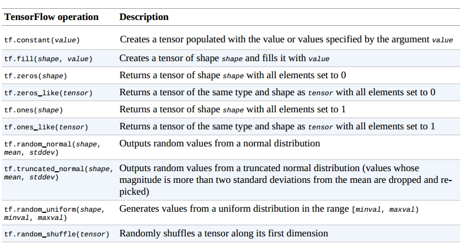

## tensor and flow

### 1 . tensor

* tensor 三要素
    * name
    * dtype
    * shape
* 可以利用 tf.cast转换类型
```
x = tf.constant([1,2,3],name='x',dtype=tf.float32)
print(x.dtype)
x = tf.cast(x,tf.int64)
print(x.dtype)
Out:
<dtype: 'float32'>
<dtype: 'int64'>
```
* 利用 get_shape() 可以获得tensor的shape
* 可以利用初始化器初始化


* 初始化方法




####  Variables, Placeholders, and Simple Optimization

* 优化的过程要求变量可以在图中持续保存，并且更新。而Tensor的状态是“refilled” 在每一次运行session的时候。
variable的不是这种方式，它可以持续保存固定的状态在图中，
* 两步设置 variable 
    1. 调用  `tf.Variable()`并且传入初始化函数。
    2. 运行 `tf.global_variables_initializer()`显式初始化
* 上面这种方式初始化，每次运行run的时候都会重新生成一个新的变量 `get_variable`更节省资源。
* 利用 `ph = tf.placeholder(tf.float32,shape=(None,10))`定义需要输入的数据，然后在session.run的时候feeddict
```
sess.run(s,feed_dict={x: X_data,w: w_data})
```


### 2. flow


* 矩阵相乘 `tf.matmul(A,B)`
* 也可以通过 `tf.expand_dims()`扩展tensor的尺寸
* 可以利用 `with tf.name_scope("prefix_name"):`来给tensor定义name作用域。

---